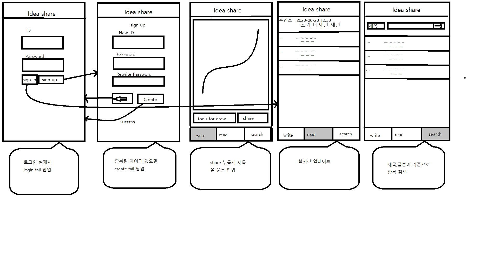

# Drawing Share application Open Source Project

We are going to make application. It shares a image which you have just drawn in real time like messenger.

Shared image is uploded on DB. You can search and manage your imagaes with users.

You do not need to use both drawing program and messenger together anymore if you use this application!

You can see our github on [https://github.com/HyunilSong/TeamProject](https://github.com/HyunilSong/TeamProject)

### If you want to join in this project (Welcome!!!)

Please send E-mail to : thdgusdddd@gmail.com

We will send you invitation mail like this

You can accept or decline our invitation.

### Brief description of structure

1. Login is required because access to the repository must be restricted for each individual

2. If you sign in, you entered in drawing section.

3. You can share a drawn image with users in real time.

4. You can find the image by title and author.

